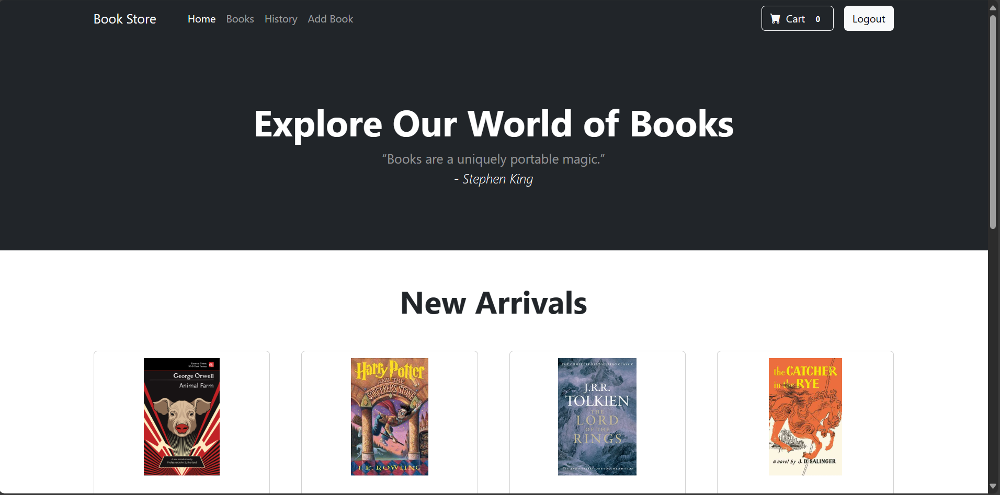
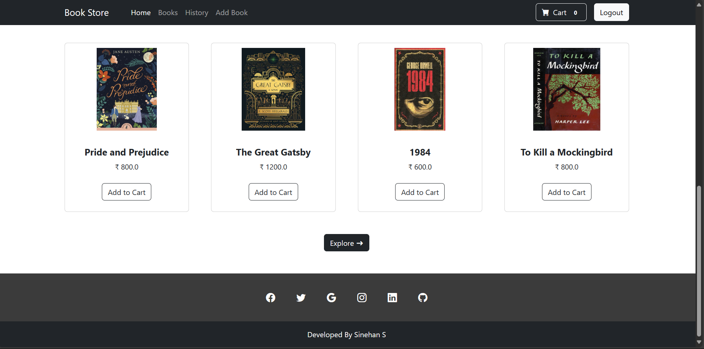
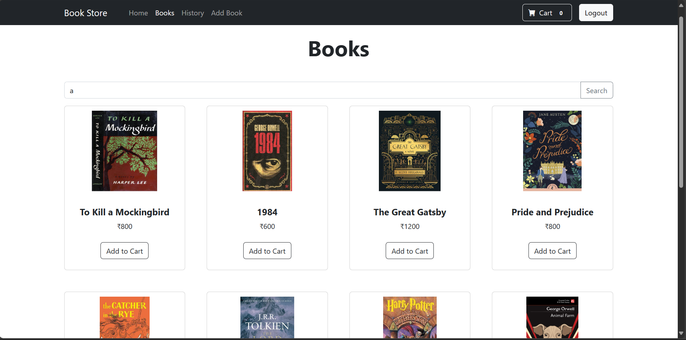
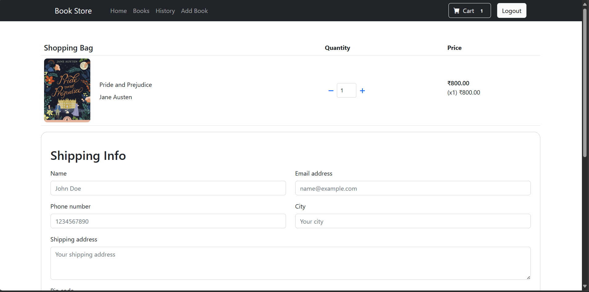
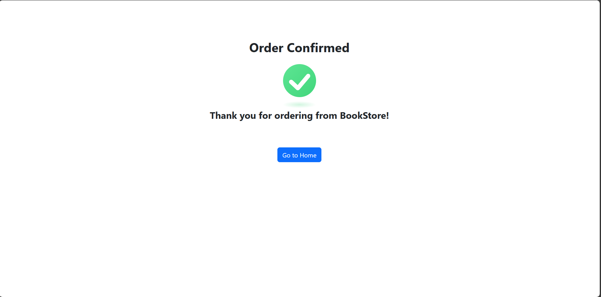
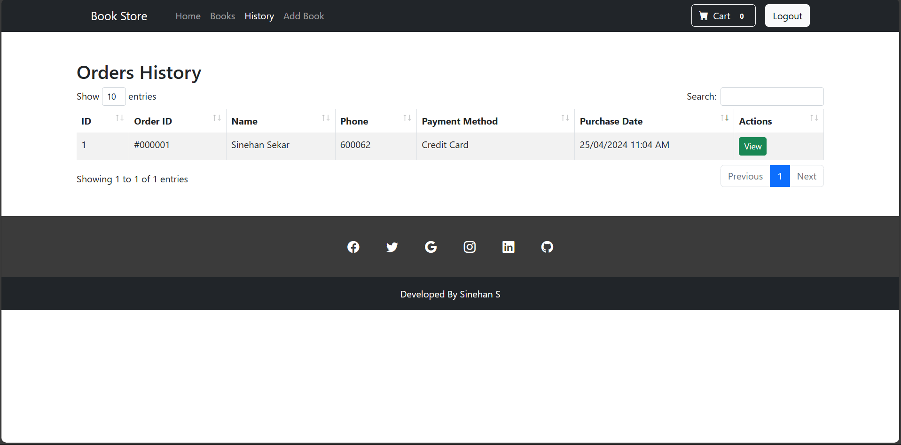
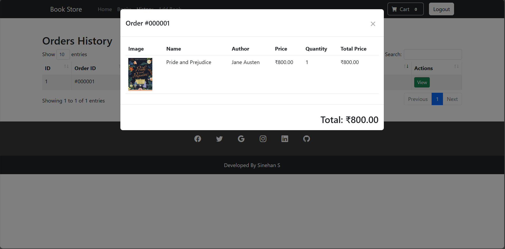
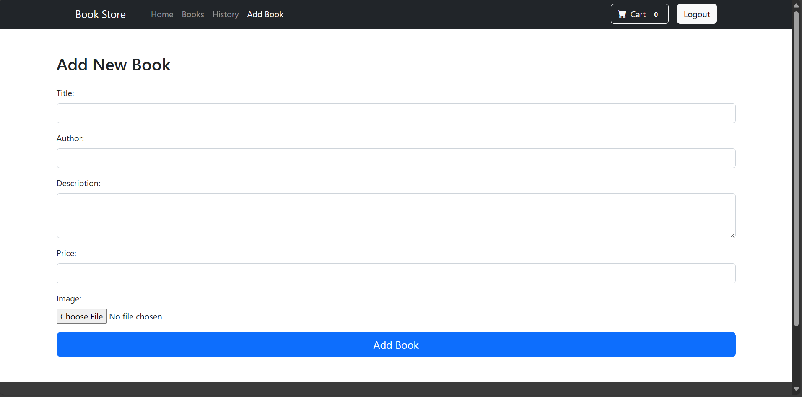

# Bookstore Web Application

This is a simple bookstore web application developed using Java Servlets and JSP (JavaServer Pages) and deployed on Apache Tomcat.

## Requirements

Before you begin, ensure you have met the following requirements:

- **Java Development Kit (JDK):** OpenJDK 11 or later
- **Apache Tomcat:** Version 9.x
- **MySQL Server:** Version 5.7 or later

## Getting Started

To run this application locally, follow these steps:

1. **Download the WAR file in GitHub:**

- [bookstore.war](https://github.com/sinehan001/BookStore)

2. **Deploy the WAR file to Apache Tomcat:**

- Copy the `bookstore.war` file to the `webapps` directory of your Tomcat installation.

3. **Start Apache Tomcat:**

- Start the Apache Tomcat server.

4. **Access the application:**

   - Open a web browser and go to `http://localhost:8080/bookstore` to access the application.

## Changes to be done

1. Configure your database by creating database name `bookstore`,

2. Download the [bookstore.sql](https://github.com/sinehan001/BookStore) from the GitHub.

3. Import the `bookstore.sql` file to bookstore database.

4. Then set the username as `root` user and password as `sify123`.

- To change the root password as below code
```bash
SET PASSWORD FOR 'root'@'localhost' = PASSWORD('sify123');
FLUSH PRIVILEGES;
```

5. To add Book, login using the below credentials

```bash
Username - admin
Password - admin123
```

## AWS Hosted Website

This application is also hosted on AWS. You can access it using the following URL:

- [BookStore Web Application](https://sinehan.tech/BookStore/register)

## Screenshots












## Contributors

- [Sinehan S](https://github.com/sinehan001)

Feel free to contribute to this project by creating issues or pull requests.


## License

[MIT](https://choosealicense.com/licenses/mit/)

